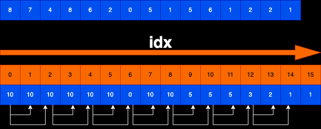

# 题目描述
规定1和A对应、2和B对应、3和C对应...26和Z对应
那么一个数字字符串比如"111”就可以转化为:
"AAA"、"KA"和"AK"
给定一个只有数字字符组成的字符串str，返回有多少种转化结果

# 题解
当前以 874862051561221 来解析

## 核心思路
暴力递归：str[0...idx-1]转化无需过问，str[idx...]去转化，返回有多少种转化方法  
动态规划：str[idx...]有多少种转化方式，dp[idx]代表str[idx...]的转换方式有多少种

## base case
1. 暴力递归：
   1. 当idx到str.length的时候，就说明找到了一种方法
   2. idx所在字符为0的时候，无论是idx字符单独转换，还是和idx+1字符一起转换，都无法转换，所以认为当前这种情况无法转换，返回0种方法
2. 动态规划：
   1. idx=str.length的时候，默认找到一种方法，即dp[str.length] = 1
## 依赖关系

str[idx]为0：无法转换，dp[idx]为0  
str[idx]不为0：dp[idx]依赖dp[idx+1]和dp[idx+2] 两个位置的结果

填表顺序：大方向idx从大到小填