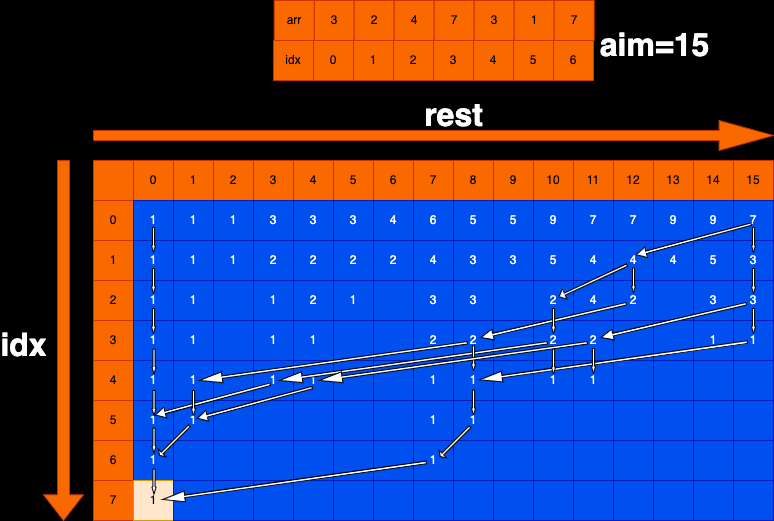

# 题目描述
arr是货币数组，其中的值都是正数。再给定一个正数aim。  
每个值都认为是一张货币， 即便是值相同的货币也认为每一张都是不同的， 返回组成aim的方法数。  
例如：arr = {1,1,1}，aim = 2。  
第0个和第1个能组成2，第1个和第2个能组成2，第0个和第2个能组成2，一共就3种方法，所以返回3。

# 题解：
当前以 arr = {3, 2, 4, 7, 3, 1, 7}, aim = 15来解析

## 核心思路
从右往左做选择，在每一个位置上决策要不要当前这个货币

## base case：
当idx在arr.length的位置，超过数组长度了，这里没有货币可选了，当rest为0时，认为找到了一种方法  
即dp[arr.length][0] = 1

## 依赖关系：
idx依赖：依赖idx+1位置的选择  
rest依赖：依赖rest-arr[idx]  
dp[idx][rest]依赖：dp[idx+1][rest] 与 dp[idx+1][rest-arr[idx]]

填表顺序：大方向idx从大到小填,rest从小到大填