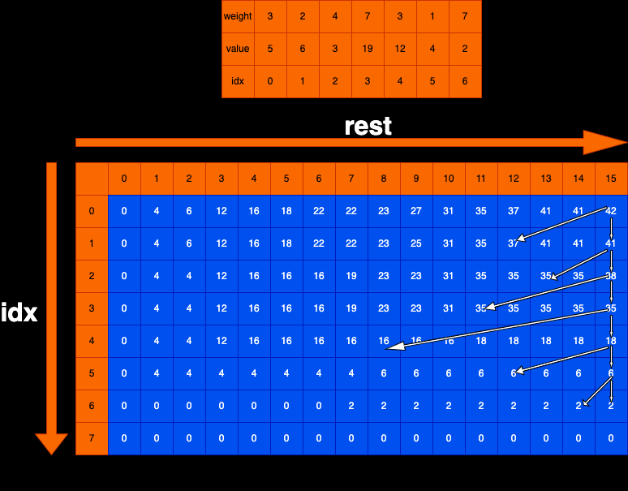

# 题目描述：

给定两个长度都为N的数组weights和values，weights[i]和values[i]分别代表 i号物品的重量和价值。  
给定一个正数bag，表示一个载重bag的袋子，你装的物品不能超过这个重量。  
返回你能装下最多的价值是多少?

# 题解：
当前以weights = {3, 2, 4, 7, 3, 1, 7}, values = {5, 6, 3, 19, 12, 4, 2}, bag = 15来解析

## 核心思路
从右往左做选择，在每一个位置上决策要不要当前这个背包

## base case：
当idx在w.length的位置，超过数组长度了，这里没有背包，无论rest为多少，总价值都是0  
即dp[w.length][0~bag] = 0

## 依赖关系：
idx依赖：依赖idx+1位置的选择  
rest依赖：依赖rest-w[idx]  
dp[idx][rest]依赖：dp[idx+1][rest] 与 dp[idx+1][rest-w[idx]]

填表顺序：大方向idx从大到小填,rest从小到大填