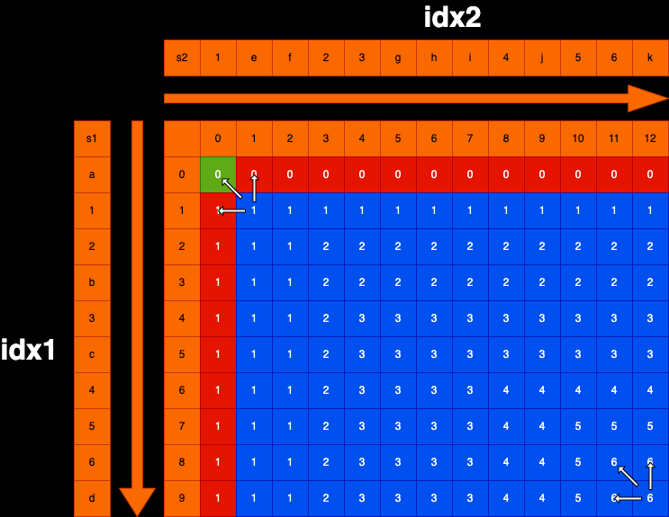

# 题目描述
给定两个字符串str1和str2，返回这两个字符串的最长公共子序列长度

比如 ： str1 = “a12b3c456d”,str2 = “1ef23ghi4j56k”
最长公共子序列是“123456”，所以返回长度6

# 题解：
当前以str1 = “a12b3c456d”,str2 = “1ef23ghi4j56k”来解析

## 可能性分类:
str1[0...i]和str2[0...j]，这个范围上最长公共子序列长度是多少？  
a) 最长公共子序列，不以str1[idx1]字符结尾、也不以str2[idx2]字符结尾  
b) 最长公共子序列，以str1[idx1]字符结尾、但是不以str2[idx2]字符结尾  
c) 最长公共子序列，不以str1[idx1]字符结尾、但是以str2[idx2]字符结尾  
d) 最长公共子序列，以str1[idx1]字符结尾、也以str2[idx2]字符结尾  

## 核心思路
以结尾组织可能性，dp[idx1][idx2]含义为以idx1结尾和以idx2结尾，最长子序列长度是多少

## base case
dp[0][0]：str1[0]==str2[0]，相等为1，不相等为0  
dp[idx1][0]：str1[idx1]==str2[0]，相等为1，不相等则为dp[idx1-1][0]，idx1的范围为1~str1.length-1  
dp[0][idx2]：str1[0]==str2[idx2]，相等为1，不相等则为dp[0][idx2-1]，idx2的范围为1~str1.length-1  

## 依赖关系：dp[idx1][idx2]
以str1[idx1]字符结尾、但是不以str2[idx2]字符结尾，dp[idx1][idx2-1]  
不以str1[idx1]字符结尾、但是以str2[idx2]字符结尾，dp[idx1-1][idx2]  
以str1[idx1]字符结尾、也以str2[idx2]字符结尾，str1[idx1] == str2[idx2] ? 1 + dp[idx1 - 1][idx2 - 1] : 0  
三者取最大值

填表顺序：大方向idx1从小到大填，idx2从小到大填