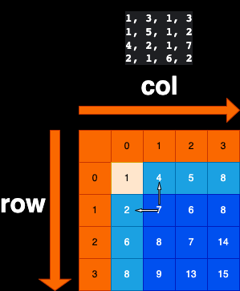

# 题目描述
力扣第64题《最小路径和》  
https://leetcode.cn/problems/minimum-path-sum/description/?utm_source=LCUS&utm_medium=ip_redirect&utm_campaign=transfer2china  
给定一个二维数组matrix，一个人必须从左上角出发，最后到达右下角
沿途只可以向下或者向右走，沿途的数字都累加就是距离累加和
返回最小距离累加和

# 题解：
当前以 {{1, 3, 1, 3}, {1, 5, 1, 2}, {4, 2, 1, 7}, {2, 1, 6, 2}} 来解析  
dp[row][col]代表走到{row,col}位置最小累加和  

## base case：
1. dp[0][0]：是当前起始位置必走，最小累加和为m[0][0]  
2. dp[0][col]：横着走的累加和，最小累加和为dp[0][col-1] + m[0][col]，col的范围是1～colLen-1  
3. dp[row][0]：竖着走的累加和，最小累加和为dp[row-1][0] + m[row][0]，row的范围是1～rowLen-1  

## 依赖关系：
1. row依赖：row依赖row-1的位置  
2. col依赖：col依赖col-1的位置  
3. dp[row][col]依赖：左和上两个位置，dp[row-1][col]和dp[row][col-1]取最小值

填表顺序：大方向row和col从小到大填写

# 进阶
数组压缩：每一行只依赖上一行，可以用一维数组来替代