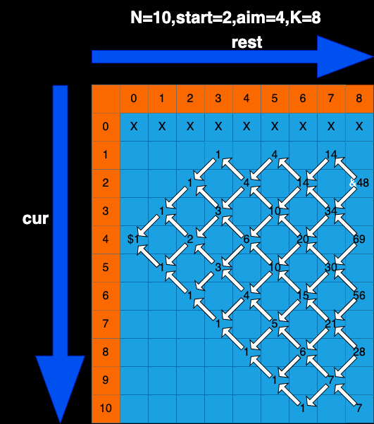

# 题目描述：

假设有排成一行的N个位置，记为1~N，N 一定大于或等于 2  
开始时机器人在其中的M位置上(M 一定是 1~N 中的一个)  
如果机器人来到1位置，那么下一步只能往右来到2位置；  
如果机器人来到N位置，那么下一步只能往左来到 N-1 位置；  
如果机器人来到中间位置，那么下一步可以往左走或者往右走；  
规定机器人必须走 K 步，最终能来到P位置(P也是1~N中的一个)的方法有多少种  
给定四个参数 N、M、K、P，返回方法数。

# 题解：
当前以 N=10,start=2,aim=4,K=8来解析

## base case：
当机器人剩余步数rest为0的时候  
如果机器人当前位置cur在目标aim位置上，则认为找到了一种方法，返回1  
如果机器人当前位置cur不在目标aim位置上，则认为没有找到，返回0  
所以dp[aim][0] = 1, dp[其它位置][0] = 0

## 依赖关系：
rest依赖：rest依赖rest-1的位置  
cur依赖：cur依赖cur+1和cur-1位置  
dp[cur][rest]依赖左上和左下两个位置，dp[cur][rest] = dp[cur+1][rest-1] + dp[cur-1][rest-1]

填表顺序：大方向rest从小到大填写