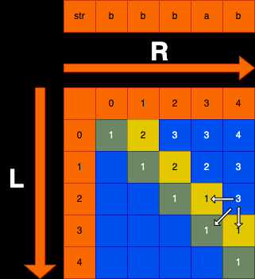

# 题目描述
给定一个字符串str，返回这个字符串的最长回文子序列长度
比如 ： str = “a12b3c43def2ghi1kpm”
最长回文子序列是“1234321”或者“123c321”，返回长度7

# 题解：
当前以str = “bbbab”来解析

## 可能性分类:
str[L...R]，这个范围上最长回文子序列长度是多少？  
a) 最长回文子序列，不以str[L]字符开头、也不以str[R]字符结尾  
b) 最长回文子序列，以str[L]字符开头、不以str[R]字符结尾  
c) 最长回文子序列，不以str[L]字符开头、以str[R]字符结尾  
d) 最长回文子序列，以str[L]字符开头、也以str[R]字符结尾

## 核心思路
以开头和结尾组织可能性，dp[L][R]含义为以L开头和以R结尾，最长回文子序列长度是多少

## base case
dp[L][L]：只有一个字符认为是回文，长度为1，L的范围为0~str.length-1  
dp[L][L+1]：str[L]==str[L+1]，相等为2，不相等则为0，L的范围为1~str.length-2  

## 依赖关系：dp[L][R]
以str[L]字符开头、但是不以str[R]字符结尾，dp[L][R-1]  
不以str[L]字符开头、但是以str[R]字符结尾，dp[L+1][R]  
以str[L]字符开头、也以str[R]字符结尾，str[L] == str[R] ? 2 + dp[L - 1][R - 1] : 0  
三者取最大值

填表顺序：大方向L从大到小填，R从小到大填；也就是从下往上，从左到右