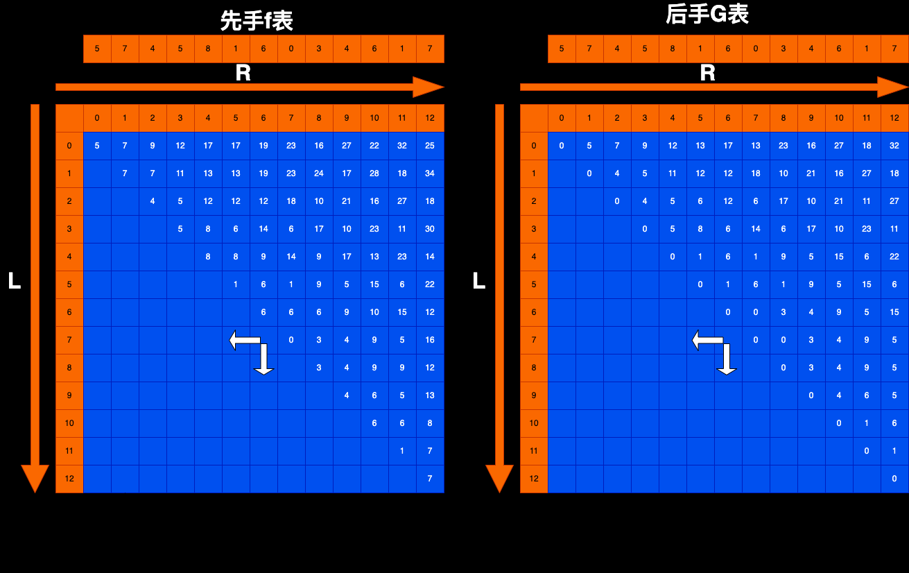

# 题目描述：

给定一个整型数组arr，代表数值不同的纸牌排成一条线  
玩家A和玩家B依次拿走每张纸牌，规定玩家A先拿，玩家B后拿，但是每个玩家每次只能拿走最左或最右的纸牌  
玩家A和玩家B都绝顶聪明，请返回最后获胜者的分数。

# 题解：
当前以 {5, 7, 4, 5, 8, 1, 6, 0, 3, 4, 6, 1, 7}来解析

## 基本原则：
先手：拥有主动权，一定从L～R左右两边，获取arr[L]+g(L+1~R)和arr[R]+g(L~R-1)的最大值  
后手：没有主动权，先手一定会留下f(L+1~R)和f(L~R-1)的最小值让你去选择

## base case：
当L==R时：先手获得arr[L]的分数，后手获得0的分数，即f[L][L] = arr[L]，g[L][L] = 0  

## 依赖关系：
先手f[L][R]依赖：依赖左边和下面两个位置，g[L+1][R]和g[L][R-1]
后手g[L][R]依赖：依赖左边和下面两个位置，f[L+1][R]和f[L][R-1]

填表顺序：大方向L从下到上填，R从左到右填